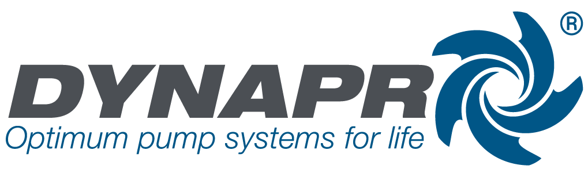
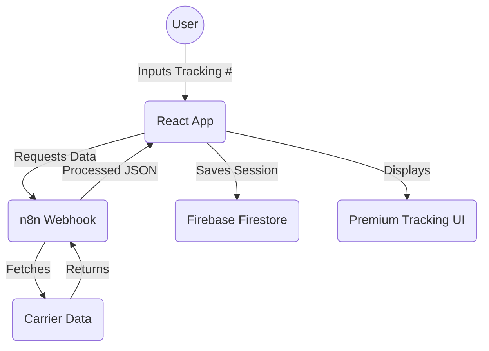

# 🚚 Dynapro Tracking System

<div align="center">
  
  <br/>
  <strong>State-of-the-Art Shipment Tracking Experience</strong>
  <br/><br/>

  [](https://tracking-system-3b6fc.web.app)
  [](https://reactjs.org/)
  [](https://www.typescriptlang.org/)
  [](https://vitejs.dev/)
  [](https://tailwindcss.com/)
  [](LICENSE)

  <p align="center">
    <a href="https://tracking-system-3b6fc.web.app">Live Demo</a> •
    <a href="#-architecture">Architecture</a> •
    <a href="#-getting-started">Getting Started</a> •
    <a href="#-deployment">Deployment</a>
  </p>
</div>

---

## 📖 Overview

The **Dynapro Tracking System** is a premium web application designed to provide customers with an elite, transparent, and real-time shipment monitoring experience. Built with a focus on visual excellence and performance, it leverages modern web technologies to deliver a seamless across all devices.

### Key Value Propositions
- **Visual Transparency:** Detailed timelines showing every step of the journey.
- **Micro-interactivity:** Smooth transitions, hover effects, and responsive navigation.
- **Real-time Accuracy:** Direct integration with tracking webhooks.

---

## ✨ Features in Detail

### 🔍 Smart Tracking Input
- **Instant Validation:** Real-time feedback on tracking number formats.
- **Glassmorphism Design:** A modern, frosted-glass look that feels premium.
- **High Performance:** Debounced inputs and optimized re-renders.

### 📍 Interactive Timeline
- **Milestone Tracking:** Clear markers for every shipment event (Order Received, In Transit, Delivered, etc.).
- **Dynamic Icons:** Context-aware icons for each status update using `lucide-react`.
- **Chronological Sorting:** Automatically sorts events from newest to oldest.

### 🛡️ Secure Infrastructure
- **Firebase Firestore:** Synchronized data storage for tracking sessions.
- **SSL Encryption:** Mandatory HTTPS through Firebase Hosting.
- **Global CDN:** Distributed assets for sub-second load times worldwide.

---

## 🛠️ Technological Excellence (The Stack)

### Core Frontend
- **React 19:** Utilizing the latest hooks and concurrent rendering features.
- **TypeScript:** Strict type safety for shipment data, ensuring zero runtime undefined errors.
- **Vite:** Next-generation frontend tooling for instantaneous Hot Module Replacement (HMR).

### Styling & Animation
- **Vanilla CSS:** Custom design tokens for colors, spacing, and shadows for maximum flexibility.
- **Tailwind CSS:** Layout utilities used for rapid, responsive grid and flexbox management.
- **Modern Typography:** Utilizing clean, sans-serif fonts optimized for readability.

### Backend & DevOps
- **Firebase SDK:** Client-side initialization for direct database and analytics access.
- **N8N Automation:** Backend workflows handling external API calls to carrier systems.
- **CI/CD Capability:** Ready for GitHub Actions deployment integration.

---

## 🏗️ Architecture



---

## 📁 Detailed Folder Structure

```text
Tracking System/
├── public/              # Static public assets
├── src/
│   ├── assets/          # Logos and design assets
│   ├── components/      # Reusable UI components
│   │   ├── Header.tsx       # Dynapro branded header
│   │   ├── Timeline.tsx     # Vertical tracking events
│   │   ├── TrackingInput.tsx# Main search component
│   │   └── TrackingResult.tsx# Content area for results
│   ├── hooks/           # Business logic abstraction
│   │   └── useTracking.ts   # Core fetching and state logic
│   ├── types/           # Domain-driven Type definitions
│   │   └── tracking.ts      # Shipment and Milestone interfaces
│   ├── firebase.ts      # SDK initialization and exports
│   ├── App.tsx          # Root layout and composition
│   ├── index.css        # Global styles and design tokens
│   └── main.tsx         # Virtual DOM entry point
├── .firebase/           # Firebase metadata
├── firestore.rules      # Database security configuration
└── tailwind.config.js   # Style utility configuration
```

---

## 🚀 Getting Started

### 1. Environment Setup
Create a `.env` file (if not present) with your details:
```env
VITE_FIREBASE_API_KEY=your_api_key
VITE_N8N_WEBHOOK_URL=your_webhook_url
```

### 2. Installation
```bash
# Install dependencies
npm install

# Start development server
npm run dev
```

### 3. Production Build
```bash
# Generate optimized assets
npm run build

# Preview build locally
npm run preview
```

---

## 🚢 Deployment & Maintenance

### Hosting Deployment
We use **Firebase Hosting** for its reliability and direct integration.
```bash
# One-line deployment
npx firebase-tools deploy --only hosting
```

### Best Practices for Contributors
1. **Strict Typing:** Never use `any`. Always define interfaces in `src/types`.
2. **Component Purity:** Keep components focused on UI; move logic to `hooks`.
3. **Styling:** Use CSS Variables in `index.css` for brand colors (`--dynapro-blue`, etc.).
4. **Testing:** Verify responsive breakpoints (Mobile < 768px).

---

## 📈 Roadmap (Future Improvements)
- [ ] Email/SMS notification enrollment.
- [ ] Native mobile app (React Native) transformation.
- [ ] Multi-language support (i18n).
- [ ] Map integration for visual location tracking.

---

## 📄 License & Legal
© 2026 **Dynapro**. Confidential and Proprietary.
Unauthorized copying or distribution of this software is strictly prohibited.

---

<div align="center">
  Built with ❤️ by the Dynapro Engineering Team
</div>
